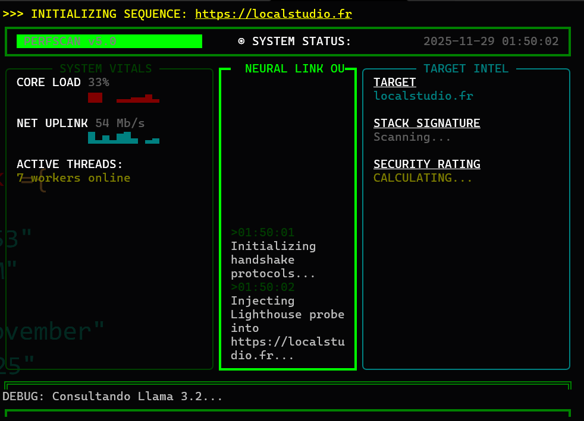
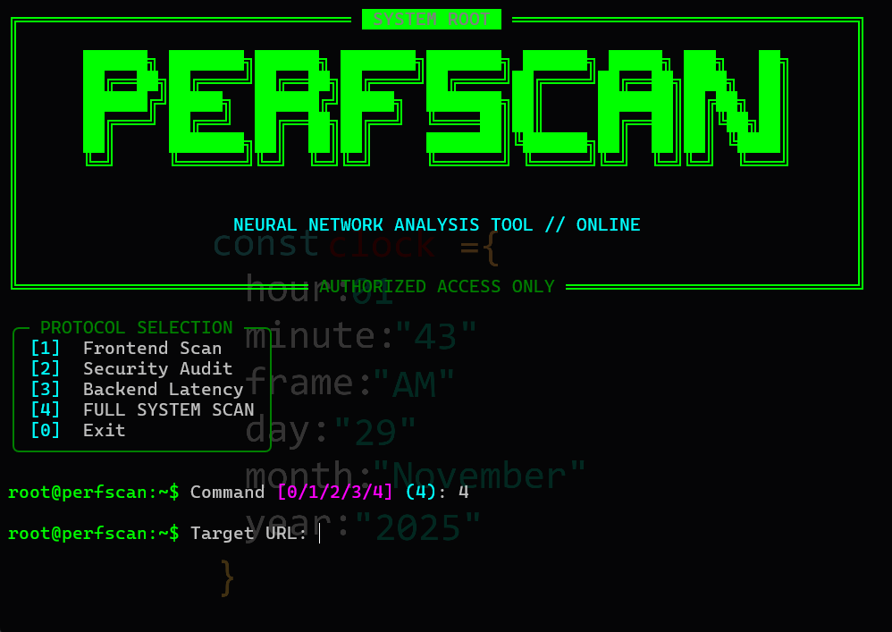
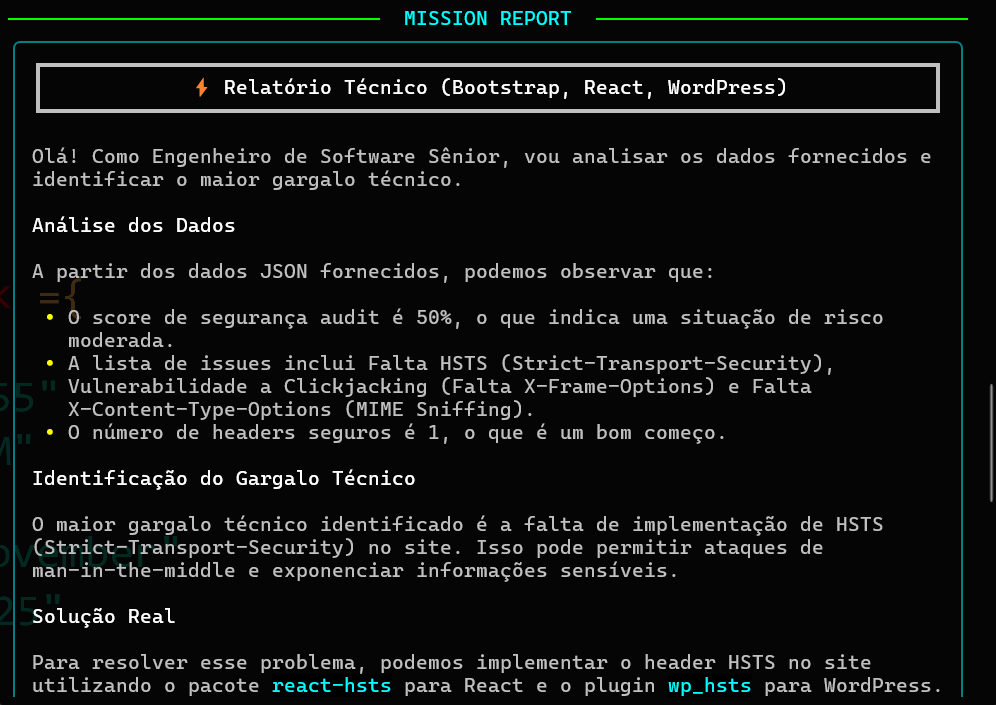
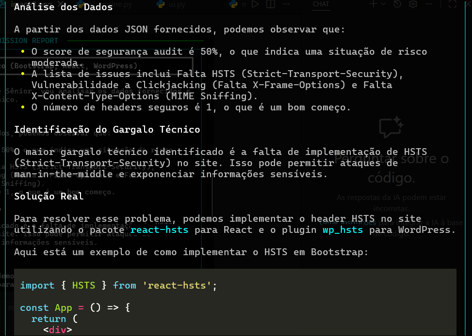

<div align="center">

# ⚡ P E R F S C A N — X 9 0 0

**SYSTEM AUDIT TOOL • NEURAL NETWORK POWERED • GOD MODE UI**

[](https://python.org)
[](https://ollama.com)
[]()
[]()

<br>



<br>

<p align="center">
  <b>O PerfScan X-900 é uma unidade de inteligência tática para auditoria web.</b><br>
  Ele combina a precisão do Google Lighthouse, a profundidade do Playwright e o raciocínio de uma IA Neural Local (Llama 3.2) para entregar diagnósticos de nível sênior diretamente no seu terminal.
</p>

</div>

---

## 📸 Interface Tática (Visual Preview)

A interface foi desenhada para **máxima imersão** e eficiência, utilizando renderização assíncrona com gráficos vivos (Sparklines).

| **Inicialização & Menu** | **Scanner Neural (God Mode)** |
|:---:|:---:|
|  |  |
| *Decodificação estilo Matrix e Menu Tático* | *Monitoramento de CPU/Rede e Logs em Tempo Real* |

| **Detecção de Stack** | **Relatório de Missão** |
|:---:|:---:|
|  |  |
| *Identificação automática de tecnologias* | *Diagnóstico escrito por IA (Llama 3.2)* |

---

## 🛠️ O Arsenal (Funcionalidades)

### 🧠 1. Neural Engine (IA Local)
Esqueça ifs genéricos. O PerfScan usa o **Llama 3.2 (3B)** rodando localmente no seu hardware.
* **Contexto Real:** A IA sabe se o site é React, WordPress ou Laravel e adapta as dicas.
* **Zero Alucinação:** Prompt blindado para garantir termos técnicos corretos.
* **Privacidade:** Nenhum dado sai da sua máquina.

### 🕵️ 2. Sherlock Tech Detector
O scanner identifica a assinatura digital do alvo:
* **Frameworks:** Next.js, Vue, Nuxt, Svelte, Vite.
* **CMS:** WordPress, Shopify, VTEX.
* **Infra:** Cloudflare, Nginx, Vercel.

### 🛡️ 3. Auditoria de Segurança Real
Verificação matemática (Python Puro) de headers de defesa:
* `Strict-Transport-Security` (HSTS).
* `X-Frame-Options` (Clickjacking).
* Detecção de vazamento de informações do servidor.

### ⚡ 4. Deep Performance
* **TTFB Real:** Medido via headless browser (Playwright).
* **Core Web Vitals:** LCP, CLS e métricas extraídas do motor Chromium.

---

## 🚀 Instalação e Uso

### Pré-requisitos
1.  **Python 3.10+** instalado.
2.  **Ollama** instalado e rodando (`ollama pull llama3.2`).

### Instalação Automática

```bash
# 1. Clone o repositório
git clone [https://github.com/Xwiuu/perfscan.git]
cd perfscan

# 2. Prepare o ambiente virtual
python -m venv venv
# Windows:
.\venv\Scripts\activate
# Linux/Mac:
source venv/bin/activate

# 3. Instale o Arsenal (Dependências + Comando Global)
pip install -e .

# 4. Instale os navegadores do Playwright
python -m playwright install