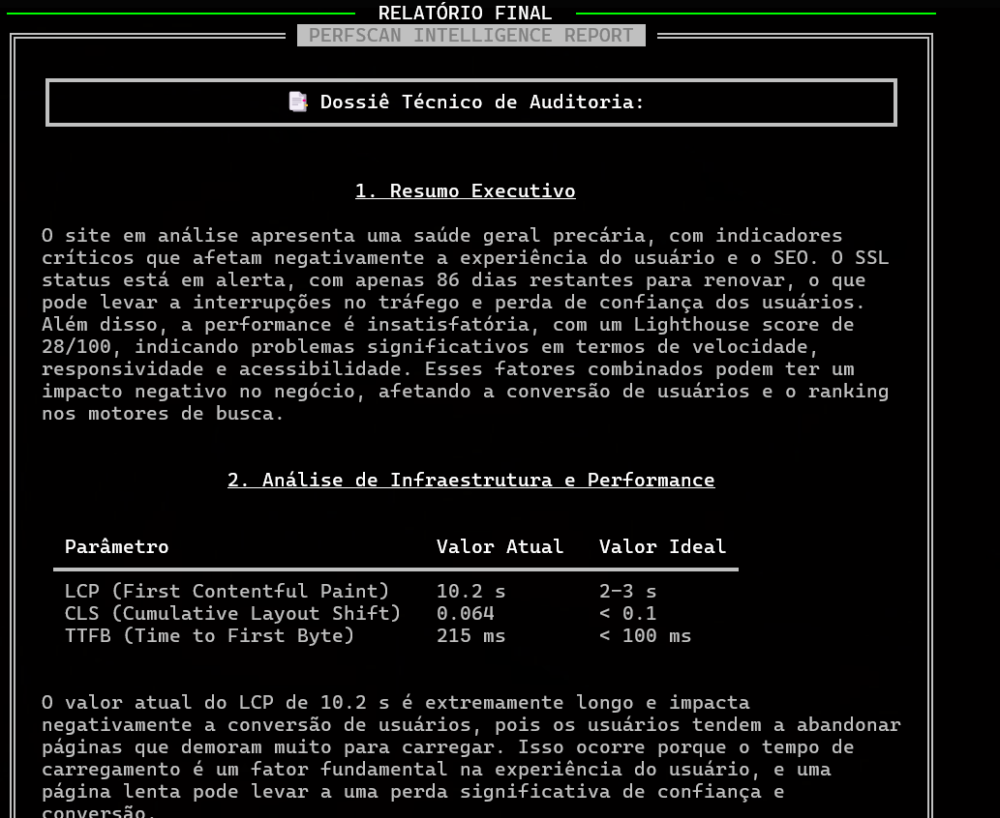
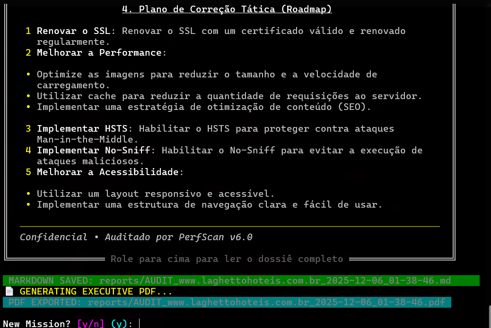

<div align="center">


# ⚡ P E R F S C A N — V 6 . 0

**CYBERSECURITY AUDIT • NEURAL NETWORK POWERED • GOD MODE UI**

[](https://python.org)
[](https://ollama.com)
[]()
[]()

<br>

<p align="center">
  <b>O PerfScan não é apenas um scanner. É uma unidade de inteligência tática.</b><br>
  Uma ferramenta CLI completa que combina a precisão do <b>Google Lighthouse</b>, a profundidade do <b>Playwright</b> e o raciocínio de uma <b>IA Neural Local (Llama 3.2)</b> para gerar diagnósticos de nível sênior.
</p>

</div>

---

## 📸 Interface Tática (Visual Preview)

A interface foi desenhada para **máxima imersão** e eficiência, utilizando renderização assíncrona com gráficos vivos (Sparklines) e feedback em tempo real.

| **Inicialização & Menu** | **Scanner Neural (God Mode)** |
|:---:|:---:|
|  |  |
| *Decodificação Matrix e Seleção de Protocolo* | *Monitoramento de CPU/Rede e Logs Vivos* |

| **Relatório de Inteligência** | **Exportação Executiva** |
|:---:|:---:|
|  |  |
| *Diagnóstico escrito por IA (Llama 3.2)* | *Geração automática de Dossiê PDF* |

---

## 🛠️ O Arsenal (Funcionalidades)

### 🧠 1. Neural Engine (IA Local)
Esqueça respostas genéricas. O PerfScan usa o **Llama 3.2 (3B)** rodando localmente no seu hardware via Ollama.
* **Contexto Real:** A IA recebe a stack detectada (React, WordPress, Laravel) e adapta as soluções.
* **Prompt Blindado:** Instruções rígidas de "Chain of Thought" para evitar alucinações.
* **Privacidade:** Nenhum dado sai da sua máquina.

### 🕷️ 2. Spider Crawler V4 (Stealth)
Uma aranha cibernética avançada para mapeamento de site.
* **Injeção de JavaScript:** Captura links escondidos em SPAs (React/Vue).
* **Scroll Tático:** Rola a página automaticamente para carregar conteúdo Lazy Load.
* **Filtro Inteligente:** Separa links internos de conexões externas.

### 🕵️ 3. Sherlock Tech Detector
Identificação de assinatura digital do alvo em tempo real:
* **Frameworks:** Next.js, Vue, Nuxt, Svelte, Vite.
* **CMS:** WordPress (detecta plugins e temas), Shopify, VTEX.
* **Infra:** Cloudflare, Nginx, Vercel.

### 🛡️ 4. Auditoria de Segurança Real
Verificação matemática (Python Puro) de headers de defesa:
* `Strict-Transport-Security` (HSTS).
* `X-Frame-Options` (Clickjacking).
* Detecção de vazamento de informações do servidor.

### 📄 5. Relatório Executivo (PDF)
Gera automaticamente um arquivo `.pdf` formatado profissionalmente com todos os dados da auditoria, pronto para ser enviado ao cliente.

---

## 🚀 Instalação e Uso

### Pré-requisitos
1.  **Python 3.10+** instalado.
2.  **Ollama** instalado e rodando (`ollama pull llama3.2`).

### Instalação Automática

```bash
# 1. Clone o repositório
git clone [https://github.com/SEU_USER/perfscan.git](https://github.com/SEU_USER/perfscan.git)
cd perfscan

# 2. Prepare o ambiente virtual
python -m venv venv
# Windows:
.\venv\Scripts\activate
# Linux/Mac:
source venv/bin/activate

# 3. Instale o Arsenal (Dependências + Comando Global)
pip install -e .

# 4. Instale os navegadores do Playwright
python -m playwright install

Execução
Agora você pode invocar o sistema de qualquer lugar do terminal:

perfscan

```
---

## 📂 Estrutura do Projeto
```
perfscan/
├── main.py            # Controlador Principal (UI & Fluxo)
├── assets/            # Recursos Visuais
├── reports/           # Relatórios de missão (.md e .pdf)
├── src/
│   ├── core/          # O CÉREBRO
│   │   ├── ai.py      # Integração Llama 3.2
│   │   ├── scanner.py # Playwright + Lighthouse + Security
│   │   └── crawler.py # Spider V4 Logic
│   ├── ui/            # A FACE
│   │   ├── banners.py # Intros e Menus
│   │   └── dashboard.py # God Mode Dashboard
│   └── utils/         # FERRAMENTAS
│       └── pdf_generator.py # Motor de PDF
└── requirements.txt   # Lista de munição

```
---
## 🤝 Contribuição

Hackers são bem-vindos.

Faça um Fork.

Crie uma Branch (git checkout -b feature/NovaFeatureBraba).

Commit suas mudanças.

Abra um Pull Request.

---
<div align="center">
Desenvolvido com 💻, ☕ e Ódio a Sites Lentos.
</div>